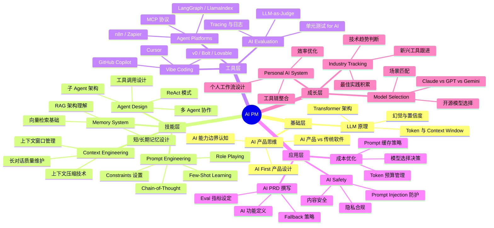
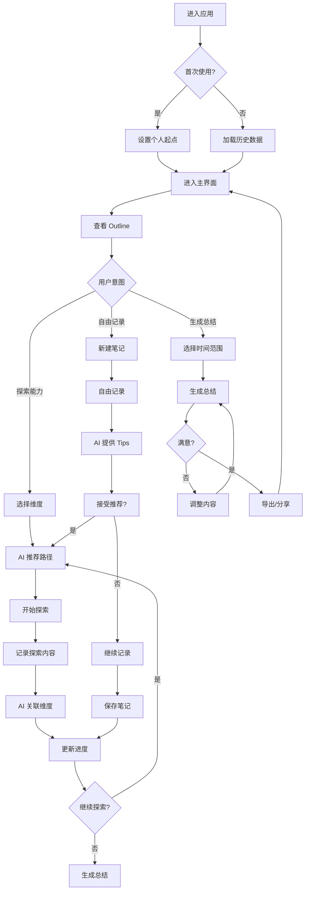

# PM Growth OS - AI PM 个人成长操作系统

## 产品需求文档（PRD）

**文档版本**：v1.0
**撰写日期**：2026年5月
**产品负责人**：MiniMax Agent
**目标用户**：希望系统化提升 AI 能力的 PM

---

## 目录（Agent-First）

- 1. 项目背景与目标
  - 1.1 背景
  - 1.2 目标
- 2. 核心使用场景
  - 场景 1：日常记录与思考
  - 场景 2：能力探索与学习
  - 场景 3：定期总结生成
  - 场景 4：多端无缝衔接
- 3. AI PM 能力框架（Skill Graph）
  - 3.1 能力维度总览
  - 3.2 能力阶段定义
  - 3.3 能力关联关系
- 4. 功能模块与边界（Capability Surface）
  - 4.1 核心功能（MVP）
  - 4.2 扩展功能（Future）
  - 4.3 明确不做
- 5. 产品形态与设计原则（UX Layer）
  - 5.1 平台形式
  - 5.2 技术约束
  - 5.3 设计原则
- 6. 核心 Agent 工作流设计
  - 6.1 Outline 概览（Progress Tracker）
  - 6.2 自由记录（Capture Agent）
  - 6.3 AI 探索引导（Coach Agent）
  - 6.4 定期总结生成（Reflection Agent）
  - 6.5 多 Agent 角色分工（待补充）
- 7. Agent 工作流与用户交互流程
  - 7.1 流程图
  - 7.2 关键体验节点
- 8. Agent 技术方案概述
  - 8.1 技术栈
  - 8.2 数据模型
  - 8.3 Agent 提示词设计
  - 8.4 记忆与状态管理（待补充）
  - 8.5 工具调用与模型路由（待补充）
  - 8.6 评测、观测与安全护栏（待补充）
- 9. 版本规划
  - v1.0（MVP）
  - v1.1
  - v2.0
- 10. 附录
  - A. 参考资源
  - B. 术语表
  - C. 版本历史

---

## 1. 项目背景与目标

### 1.1 背景

产品经理（PM）正在经历一场前所未有的能力转型。AI 技术（尤其是大语言模型）的快速发展，要求 PM 不仅要理解传统的产品管理技能，还需要掌握与 AI 协作、构建 AI 产品、甚至利用 AI 工具提升个人生产力的能力。

然而，当前市场上缺乏一个专门服务于 PM 群体的 AI 学习与成长工具。现有解决方案存在以下问题：

| 问题 | 描述 |
|------|------|
| **上下文丢失** | 在长对话中，AI 会遗忘早期内容，导致回答质量下降 |
| **工具分散** | 记录用 Notion、总结用 ChatGPT、模板用飞书，碎片化严重 |
| **缺乏系统性** | 现有的 AI 学习资料过于通用，缺乏针对 PM 的实践指导 |
| **成长不可见** | 学习过程缺乏可视化的进度追踪，难以感知成长 |

### 1.2 目标

**核心目标**：帮助 PM 用户建立系统化的 AI 能力成长路径，通过持续记录与 AI 引导，实现能力的可视化和持续提升。

**业务目标**：
- 用户能够清晰看到自己的 AI 能力成长轨迹
- 用户能够高效记录日常思考，AI 自动关联到能力维度
- 用户能够一键生成定期总结和工作计划
- 用户能够在 AI 引导下进行有方向的探索

**成功指标**：

| 指标 | 定义 | 目标 |
|------|------|------|
| 日活用户 | 每日访问应用的用户 | DAU > 100 |
| 记录完成率 | 每日记录用户 / 总用户 | > 60% |
| 能力覆盖度 | 用户探索的能力维度数 | 3个月内覆盖 5+ 维度 |
| 总结生成率 | 使用总结功能用户 / 总用户 | > 40% |

---

## 2. 核心使用场景

### 场景 1：日常记录与思考

**用户**：张明，某科技公司中级 PM
**触发条件**：工作中遇到 AI 相关问题（如"如何写好 Agent 的 Prompt"），想要随手记录思考
**使用流程**：
1. 打开应用，进入「记录」模块
2. 输入今日遇到的问题和思考
3. AI 根据内容自动关联到能力维度（如「Prompt Engineering」）
4. AI 提供相关的探索建议或 Tips
5. 张明选择接受建议进行深入，或继续自由记录
6. 记录保存，自动更新 Outline 进度

**用户收益**：随手记录 → 智能关联 → 有方向的成长

### 场景 2：能力探索与学习

**用户**：李华，希望系统提升 AI 能力的 PM
**触发条件**：想要深入了解某个 AI 能力维度（如「Context Engineering」）
**使用流程**：
1. 打开应用，进入「Outline」模块
2. 选择「Context Engineering」维度
3. AI 提供该维度的学习路径和探索议程
4. 用户开始探索，AI 逐步引导深入
5. 用户记录探索心得
6. AI 将记录关联到能力维度，更新进度

**用户收益**：清晰的学习路径 → 引导式探索 → 系统化成长

### 场景 3：定期总结生成

**用户**：王芳，需要每周提交周报的 PM
**触发条件**：周五需要撰写周报和下周计划
**使用流程**：
1. 打开应用，进入「总结」模块
2. 选择时间范围（本周）
3. AI 整合用户的所有记录，生成格式化总结
4. AI 提取关键进展和下一步计划
5. 用户调整和补充
6. 一键导出周报

**用户收益**：一键生成 → 节省时间 → 高效复用

### 场景 4：多端无缝衔接

**用户**：陈刚，移动办公为主的 PM
**触发条件**：在地铁上记录灵感，在 PC 端生成报告
**使用流程**：
1. 通勤时用手机随手记录想法
2. 到达公司后打开 PC 端，查看记录列表
3. 基于记录一键生成月度总结
4. 数据实时同步，无缝衔接

**用户收益**：移动端记录 → PC 端总结 → 数据同步

---

## 3. AI PM 能力框架（Skill Graph）

### 3.1 能力维度总览



### 3.2 能力阶段定义

| 阶段 | 描述 | 特征 |
|------|------|------|
| **入门** | 了解概念，能基础使用 | 知道是什么，能照着教程做 |
| **进阶** | 能够实践，具备独立解决问题能力 | 能用工具完成工作，识别常见问题 |
| **精通** | 深入理解，能教会他人，具备系统设计能力 | 能构建解决方案，指导团队 |

### 3.3 能力关联关系

```
LLM 原理 ──→ Prompt Engineering ──→ Context Engineering
    │                                    │
    │                                    ▼
    └──→ AI 产品思维 ──→ AI PRD 撰写 ◄──┘
                         │
                         ▼
                    Agent Design ──→ AI Evaluation
                         │                 │
                         ▼                 ▼
                    Agent Platforms   成本优化
```

---

## 4. 功能模块与边界（Capability Surface）

### 4.1 核心功能（MVP）

| 功能 | 描述 | 优先级 |
|------|------|--------|
| **Outline 概览** | 显示能力图谱和个人进度，支持点击进入详情 | P0 |
| **自由记录** | 支持文字输入，自动关联能力维度 | P0 |
| **AI 探索引导** | 基于当前能力维度提供探索建议 | P0 |
| **定期总结** | 选择时间范围，一键生成格式化总结 | P0 |
| **记录检索** | 支持按关键词、日期、能力维度检索 | P1 |
| **数据导出** | 支持导出为 Markdown/PDF 格式 | P1 |
| **多端同步** | 支持移动端和 PC 端数据同步 | P1 |

### 4.2 扩展功能（Future）

| 功能 | 描述 | 优先级 |
|------|------|--------|
| **语音记录** | 支持语音输入，自动转文字 | P2 |
| **模板市场** | 提供各类总结模板（周报/月报/复盘） | P2 |
| **社区分享** | 发布探索心得，与其他 PM 交流 | P3 |
| **能力评估** | 通过测试评估当前能力水平 | P3 |

### 4.3 明确不做

- **通用笔记功能**：不追求成为第二 Notion，专注 AI 成长场景
- **社交功能**：不追求社区运营，保持工具属性
- **离线优先**：接受需要网络连接，不做本地优先设计

---

## 5. 产品形态与设计原则（UX Layer）

### 5.1 平台形式

**Web 应用（响应式设计）**
- 移动端：单栏布局，适合记录和查看
- PC 端：多栏布局，适合深度探索和总结

### 5.2 技术约束

- 数据存储：浏览器 LocalStorage（后期可扩展云同步）
- AI 能力：集成外部 LLM API（ChatGPT/Claude）
- 部署：静态站点，无需后端服务器

### 5.3 设计原则

| 原则 | 描述 |
|------|------|
| **简洁优先** | 减少干扰，专注于记录和思考 |
| **渐进式** | 初次使用简单上手，逐步展示更多功能 |
| **成长可见** | 每一次记录都能看到能力维度的变化 |
| **AI 伴随** | AI 不是主角，而是用户的引导者和伙伴 |

---

## 6. 核心 Agent 工作流设计

### 6.1 Outline 概览

**功能描述**：展示 AI PM 能力图谱和用户个人进度

**交互设计**：
- 顶部：总体进度百分比（已探索维度 / 总维度）
- 中部：能力维度卡片列表，支持展开详情
- 卡片显示：维度名称、当前阶段（入门/进阶/精通）、探索进度条

**状态设计**：

| 状态 | 显示 |
|------|------|
| 未探索 | 灰色，标题 + 描述 |
| 探索中 | 蓝色，标题 + 进度条 |
| 已完成 | 绿色，标题 + 心得摘要 |

### 6.2 自由记录

**功能描述**：用户输入文字记录，AI 自动处理

**交互设计**：
- 输入框：支持富文本，支持 @ 提及能力维度
- AI 处理：自动识别内容关联的能力维度
- AI 建议：根据内容提供探索 Tips（可接受/忽略）

**输入示例**：
```
今天尝试用 Cursor 写了个小工具，发现 Vibe Coding 确实很快。

#PromptEngineering #ContextWindow
```

**AI 响应示例**：
```
👍 已识别关联维度：
• Vibe Coding（工具层）
• Prompt Engineering（技能层）

💡 探索建议：
你提到"Vibe Coding 很快"，可以进一步探索：
1. 如何评估 AI 生成代码的质量？
2. 什么场景下 Vibe Coding 效率最高？

是否接受引导探索？
```

### 6.3 AI 探索引导

**功能描述**：基于能力维度提供结构化的探索路径

**交互设计**：
- 选择能力维度后，显示该维度的学习路径
- 提供「探索议程」，包含：概念学习 → 实践任务 → 案例分析 → 总结反思
- 支持「自由探索」和「引导探索」两种模式

**引导示例**（Context Engineering 维度）：

```
📚 Context Engineering 探索路径

Step 1：概念理解
• 阅读：上下文窗口是什么
• 理解：为什么长对话会遗忘

Step 2：实践任务
• 任务：设计一个 10 轮对话的 Prompt
• 任务：优化你的 Prompt 减少 Token 消耗

Step 3：案例分析
• 分析：为什么 Claude 比 GPT 在长文本上表现更好

Step 4：总结反思
• 记录：你在 Context Engineering 方面的心得
```

### 6.4 定期总结生成

**功能描述**：基于时间范围内的记录，自动生成格式化总结

**交互设计**：
- 选择时间范围：本周 / 本月 / 自定义
- 选择总结类型：周报 / 月报 / 项目复盘
- 一键生成，支持编辑调整
- 导出格式：Markdown / PDF / 复制到剪贴板

**生成示例**：

```markdown
2026年5月第1周总结

本周进展
1. 完成了 Prompt Engineering 维度的探索
   - 掌握了 Chain-of-Thought 技巧
   - 实践中发现 Few-Shot 对复杂任务效果显著

2. 开始探索 Context Engineering
   - 理解了上下文窗口的限制
   - 设计了第一个长对话 Prompt

下周计划
1. 完成 Context Engineering 维度的探索
2. 开始 Agent Design 入门
3. 尝试用 Vibe Coding 构建一个小工具

反思
本周在 AI 工具使用上有明显进步，但感觉对 AI 能力的边界认知还不够清晰，下周需要加强这方面的探索。
```

---

### 6.5 多 Agent 角色分工

| Agent 角色 | 核心职责 | 对应模块 |
|------|------|------|
| **Capture Agent** | 解析用户输入、提取标签、识别能力维度 | 自由记录 |
| **Coach Agent** | 基于能力图谱生成下一步探索建议 | AI 探索引导 |
| **Reflection Agent** | 聚合阶段记录，输出周报/月报/复盘 | 定期总结 |
| **Profile Agent** | 维护用户成长画像、阶段、偏好与长期目标 | Outline / 用户画像 |

**协作原则**：
- **单一主责**：每个 Agent 只负责一类核心决策，避免一个 Prompt 同时做分类、教学、总结、画像更新。
- **显式交接**：采用「Capture → Profile → Coach / Reflection」的顺序交接，减少状态遗漏。
- **人在回路**：涉及阶段晋升、周报定稿、能力标签修正时，默认需要用户确认。
- **可回放**：每次 Agent 输出都保留输入摘要、决策原因、产出结果，便于复查与优化。

**Handoff 规则**：

| 触发条件 | 发起 Agent | 接收 Agent | 预期产出 |
|------|------|------|------|
| 用户完成一条记录 | Capture Agent | Profile Agent | 更新相关能力维度、标签、成长画像 |
| 用户接受探索建议 | Coach Agent | Profile Agent | 记录当前探索目标与阶段状态 |
| 到达固定总结周期 | Profile Agent | Reflection Agent | 周报/月报草稿 |
| 用户修改标签或阶段 | 用户 | Profile Agent | 画像校正与历史回写 |

**编排方式**：
- MVP 阶段采用轻量编排器统一调度，避免过早引入复杂多 Agent 自主协商。
- 所有 Agent 共享同一用户状态，但只允许通过标准化结构体读写，避免自由文本污染长期记忆。
- 长期目标是支持异步任务，如「每周自动总结」「探索中断后恢复」与「跨端继续上次议程」。

---

## 7. Agent 工作流与用户交互流程

### 7.1 流程图



### 7.2 关键体验节点

| 节点 | 设计要点 | 目标 |
|------|----------|------|
| **Onboarding** | 快速定位起点 → 给出第一个推荐 | 降低首次使用门槛 |
| **Aha Moment** | AI 自动关联记录到能力维度 | 感受到工具的智能 |
| **留存关键** | 每次记录后看到进度更新 | 可视化成长，激励持续使用 |

---

## 8. Agent 技术方案概述

### 8.1 技术栈

| 层级 | 技术选型 | 说明 |
|------|----------|------|
| 前端框架 | React + TypeScript | 类型安全，组件化开发 |
| 样式方案 | Tailwind CSS | 快速构建响应式 UI |
| 状态管理 | Zustand | 轻量级，适合 Web 应用 |
| 数据存储 | LocalStorage + IndexedDB | 本地持久化，支持离线 |
| AI 集成 | 外部 API（ChatGPT/Claude） | 通过 API 调用 LLM 能力 |
| 部署方案 | Vite + 静态部署 | 快速构建，一键部署 |

### 8.2 数据模型

```typescript
// 能力维度
interface Capability {
  id: string;
  name: string;           // 如 "Prompt Engineering"
  category: string;       // 如 "技能层"
  stage: 'entry' | 'advanced' | 'mastery';
  progress: number;        // 0-100
  notes: Note[];          // 关联的笔记
}

// 笔记
interface Note {
  id: string;
  content: string;
  createdAt: Date;
  updatedAt: Date;
  relatedCapabilities: string[];  // 关联的能力 ID
  tags: string[];
}

// 探索记录
interface Exploration {
  id: string;
  capabilityId: string;
  type: 'guided' | 'free';
  status: 'in_progress' | 'completed';
  steps: ExplorationStep[];
  summary: string;        // 探索总结
}

// 用户设置
interface UserSettings {
  currentStage: 'entry';
  preferredAI: 'chatgpt' | 'claude';
  weeklyGoal: number;     // 每周探索目标
}
```

### 8.3 Agent 提示词设计

**记录分析 Prompt**：
```
你是一个 AI PM 成长助手。用户刚刚记录了一段内容：

---
{用户输入}
---

请分析这段内容：
1. 识别关联的能力维度（从以下列表中选择：{维度列表}）
2. 提供 1-2 个探索建议
3. 评估内容的深度（浅/中/深）

回复格式：
维度：...
建议：...
深度：...
```

---

### 8.4 记忆与状态管理

**设计目标**：既支持 Agent 连续工作，又避免把全部历史上下文无节制塞进单次 Prompt。

| 记忆层 | 保存内容 | 更新时机 | 使用方 |
|------|------|------|------|
| **会话记忆** | 当前任务、最近 3-5 条记录、最近一次建议与用户反馈 | 单次会话内实时更新 | Capture / Coach |
| **工作记忆** | 当前探索主题、未完成议程、阶段性草稿 | 进入某个维度探索或总结流程时 | Coach / Reflection |
| **长期记忆** | 用户画像、能力进展、阶段变化、偏好设置、里程碑 | 每次确认写入后持久化 | Profile |
| **派生记忆** | 周报、月报、复盘、推荐摘要、能力卡片摘要 | 生成内容后异步归档 | Reflection / 检索 |

**状态切片**：
- **User Profile State**：当前阶段、目标岗位、偏好模型、每周目标、关注主题。
- **Capability State**：每个能力维度的阶段、进度、证据笔记、最近一次探索时间。
- **Session State**：当前页面、当前任务、上一轮 AI 输出、待确认动作。
- **Artifact State**：生成中的周报、探索计划、导出文件、可复用模板。

**状态管理原则**：
- 长期记忆只写入结构化字段，不直接写入未经确认的自由文本结论。
- 每次写入长期记忆都绑定证据来源，如某条笔记、某次探索完成、某次用户确认。
- 当上下文超长时，优先用摘要卡片替代原文回填，避免 Token 膨胀。
- 为未来的恢复执行预留 checkpoint 字段，支持中断后继续。

### 8.5 工具调用与模型路由

**工具层设计**：

| 工具类型 | 目标 | 示例输入 | 示例输出 |
|------|------|------|------|
| **检索工具** | 查询历史记录、能力图谱、模板与总结 | 关键词、能力维度、时间范围 | 命中的记录列表与摘要 |
| **提取工具** | 从自由文本中抽取标签、任务、能力证据 | 用户记录原文 | 结构化标签与能力候选 |
| **生成工具** | 生成探索建议、周报、复盘与学习路径 | 上下文摘要 + 模板 | Markdown 草稿 |
| **导出工具** | 导出 Markdown / PDF / 剪贴板内容 | 总结内容 | 导出结果或下载链接 |

**模型路由策略**：

| 任务类型 | 推荐能力 | 响应要求 | 路由原则 |
|------|------|------|------|
| **分类提取** | 低成本、稳定结构化输出 | 快、可控 | 优先小模型 |
| **探索建议** | 中等推理、风格稳定 | 有启发但不发散 | 默认中模型 |
| **长文本总结** | 长上下文、结构保持 | 高可读性 | 优先长上下文模型 |
| **关键判断** | 低幻觉、可解释 | 需要证据 | 引入二次校验或人工确认 |

**调用约束**：
- 一个用户动作最多触发一次主模型生成，其他步骤优先走结构化处理和缓存。
- 相同输入的标签提取结果优先复用缓存，降低成本与波动。
- 高成本模型只在「长总结」「复杂探索规划」「质量回退重试」时调用。

### 8.6 评测、观测与安全护栏

**评测指标**：

| 维度 | 指标 | 目标 |
|------|------|------|
| **识别质量** | 能力标签命中率 | 用户主观认可率 > 80% |
| **建议质量** | 建议采纳率 | 被接受建议占比持续提升 |
| **总结质量** | 生成后少改率 | 用户轻改即可导出 |
| **成长有效性** | 能力覆盖率、连续探索率 | 用户形成稳定成长节奏 |

**运行观测**：
- 记录 Prompt 版本、模型版本、输入长度、输出长度、耗时、失败原因。
- 记录用户是否接受建议、是否手动修正标签、是否重写总结。
- 对重点链路建立 trace：记录输入摘要、工具调用、Agent 交接、最终输出。

**安全护栏**：

| 风险 | 触发场景 | 护栏策略 |
|------|------|------|
| **幻觉建议** | 给出不准确学习路径或错误概念 | 建议绑定能力图谱与模板，不允许无依据扩写 |
| **错误映射** | 把记录错误归到能力维度 | 展示候选标签并支持用户一键修正 |
| **隐私泄露** | 记录中含公司敏感信息 | 默认本地存储；上传前做脱敏提醒 |
| **Prompt 注入** | 用户记录中包含恶意指令 | 将用户内容视为数据而非系统指令，隔离模板变量 |

**回退机制**：
- 标签识别置信度低时，降级为「给出 2-3 个候选维度」而不是强行判断。
- 总结生成失败时，退回到「时间线摘要 + 用户自行补充」模式。
- 当多次建议被拒绝时，Coach Agent 自动降低主动性，转为轻提示模式。

---

## 9. 版本规划

### v1.0（MVP）
- Outline 概览
- 自由记录
- AI 探索引导
- 定期总结生成

### v1.1
- 记录检索
- 数据导出
- 多端同步

### v2.0
- 语音记录
- 模板市场
- 能力评估测试

---

## 10. 附录

### A. 参考资源

**AI PM 学习资源**：
- [AI PM Learning Roadmap - Aakash Gupta](https://www.aakashg.com/ai-pm-learning-roadmap/)
- [Anthropic Context Engineering Guide](https://www.anthropic.com/engineering/effective-context-engineering-for-ai-agents)
- [RAG for Product Managers - Product School](https://productschool.com/blog/artificial-intelligence/rag-product-managers)

### B. 术语表

| 术语 | 定义 |
|------|------|
| Vibe Coding | 使用 AI 工具（如 Cursor）快速构建代码的工作方式 |
| Context Window | LLM 一次能处理的 Token 数量上限 |
| RAG | Retrieval-Augmented Generation，检索增强生成 |
| LLM-as-Judge | 使用 LLM 评估其他 LLM 输出质量的技术 |

### C. 版本历史

| 版本 | 日期 | 变更 |
|------|------|------|
| v1.0 | 2026-05-01 | 初始版本 |
